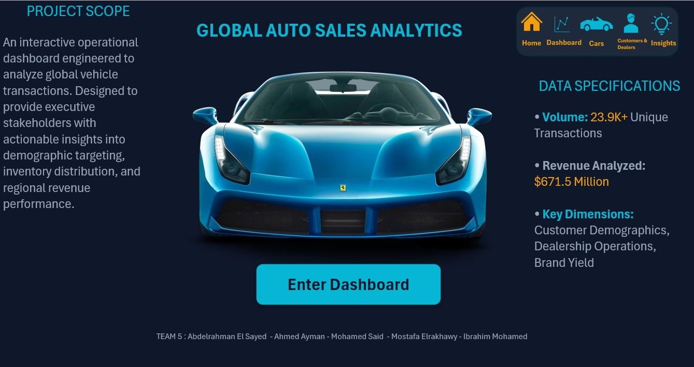
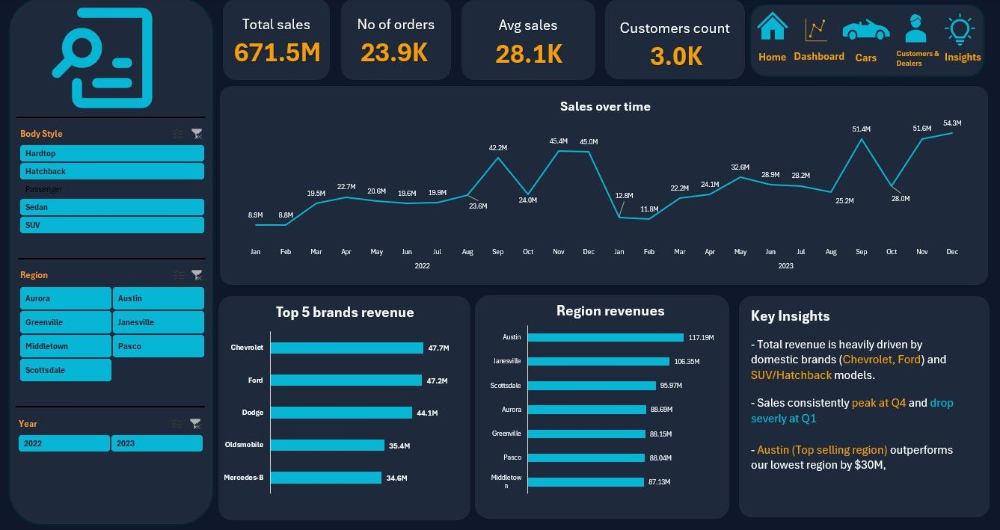
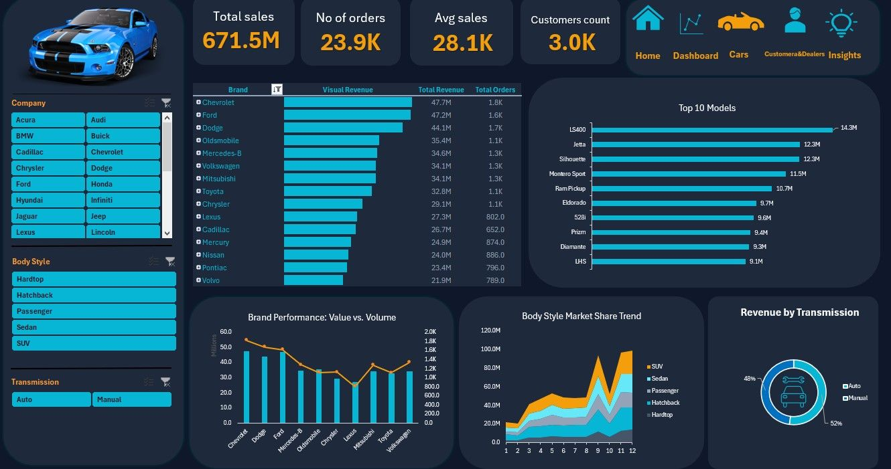
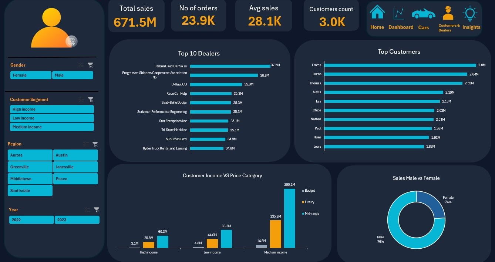
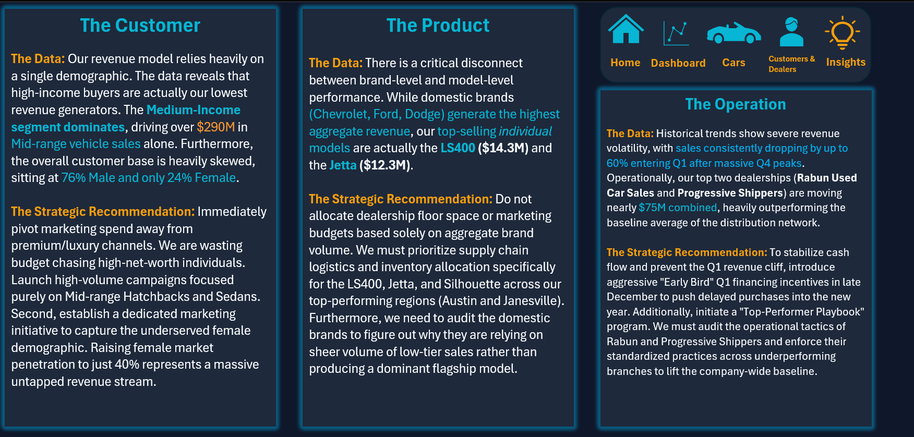
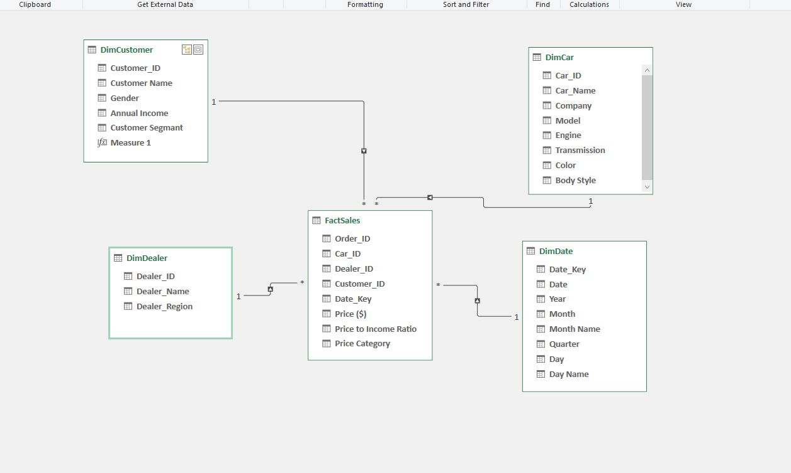

# 📊 Global Automotive Revenue Analytics (Excel BI Dashboard)

---

## 🔍 Project Overview
This project delivers a fully interactive **Executive-Level Analytics Dashboard** built entirely in **Microsoft Excel**, designed to function like a real **Business Intelligence application**.

Instead of a traditional spreadsheet, the solution simulates a **data-driven decision system** that enables executives to:
- 📊 Monitor global revenue performance  
- 🌍 Analyze customer segments and regional dynamics  
- 📈 Identify seasonality and demand patterns  
- ⚠️ Detect revenue risks and optimization opportunities  

---

## 🗄️ Data Scope & Scale
| Item | Description |
|-----|------------|
| **Total Revenue Audited** | $671.5M |
| **Transactions** | 23.9K+ global records |
| **Industry** | Automotive |
| **Dimensions** | Brand, Region, Customer Segment, Income Level, Vehicle Category, Time |

---

## 🧱 Data Modeling (Excel-Based Relational Model)
A structured **relational data model** was built inside Excel to simulate a real BI environment.

### Key Design:
- 🔗 Mapped relationships between:
  - Dealership networks  
  - Vehicle inventory  
  - Customer segments  
- 📐 Designed to behave like a **Star Schema**
- 🧠 Ensured consistent aggregation across all dimensions  
- ⚙️ Enabled scalable analysis despite Excel limitations  

---

## 🔧 Data Preparation & Cleaning
End-to-end data processing was handled using Excel tools (Power Query + formulas).

### Key Steps:
- 🧹 Cleaned inconsistencies across multiple datasets  
- 🔄 Standardized categorical values (regions, segments, vehicle types)  
- 🔗 Unified multiple data sources into a single analytical model  
- 📊 Ensured data integrity before visualization  

---

## ⚙️ Dashboard Engineering
The dashboard was engineered to simulate a **fully interactive analytical application** within Excel.

### Key Features:
- 🧭 Structured navigation across multiple analytical views  
- 🧩 Separation between data processing layer and presentation layer  
- 🎯 Clear visual hierarchy to highlight key metrics and insights  
- ⚡ Smooth and intuitive interaction for efficient data exploration  

---

## 📊 Dashboard Preview

### 🟣 Project Overview Screen

### 🔵 Executive Dashboard

### 🟠 Brand & Vehicle Analysis

### 🔴 Customer & Dealer Insights

### 🟣 Strategic Insights (Key Findings)

### 🟢 Data Model (Star Schema)

---

## 📈 Key Business Insights

### 💰 Revenue Drivers
- Medium-income customers purchasing **mid-range vehicles** generate:
  - **$290M+** → Core revenue engine  

### 📆 Seasonality Patterns
- 📉 Consistent **Q1 revenue dip** (cash flow pressure)  
- 📈 Strong **September spike** driven by:
  - New model releases  
  - Dealer incentives  

### ⚠️ Strategic Risks
- Revenue concentration in specific segments  
- Dependence on seasonal demand cycles  

---

## 🧠 Business Recommendations
- 💳 Introduce **early-year financing strategies** to stabilize Q1 performance  
- 🎯 Focus marketing on **mid-income / mid-range segment**  
- 📅 Align inventory planning with seasonal demand spikes  
- ⚖️ Balance revenue growth with sustainable demand distribution  

---

## 🛠️ Tools & Technologies
| Tool | Purpose |
|----|--------|
| Microsoft Excel | Full dashboard development |
| Power Query | Data cleaning & transformation |
| Excel Data Model | Relationship management |
| Advanced Formulas | Logic & calculations |

---

## 👥 Team Credits
This project was developed collaboratively by:

- **Mohamed Said**  
- **Mostafa ElRkhawy**  
- **Ibrahim Arafat**  
- **Abdelrahman Sayed**  
- **Ahmed Ayman**  

---

## 🚀 Key Takeaway
This project demonstrates how Excel can be leveraged to deliver a **scalable, insight-driven analytical solution** that goes far beyond traditional reporting.

---

## 👨‍💻 Author
**Mostafa ELrkhawy**  
_Data Analyst | BI Developer_

📧 **Contact:**  
[LinkedIn](https://www.linkedin.com/in/mostafa-elrkhawy)  
[Gmail](mailto:mostafaelrkhawy7@gmail.com)
